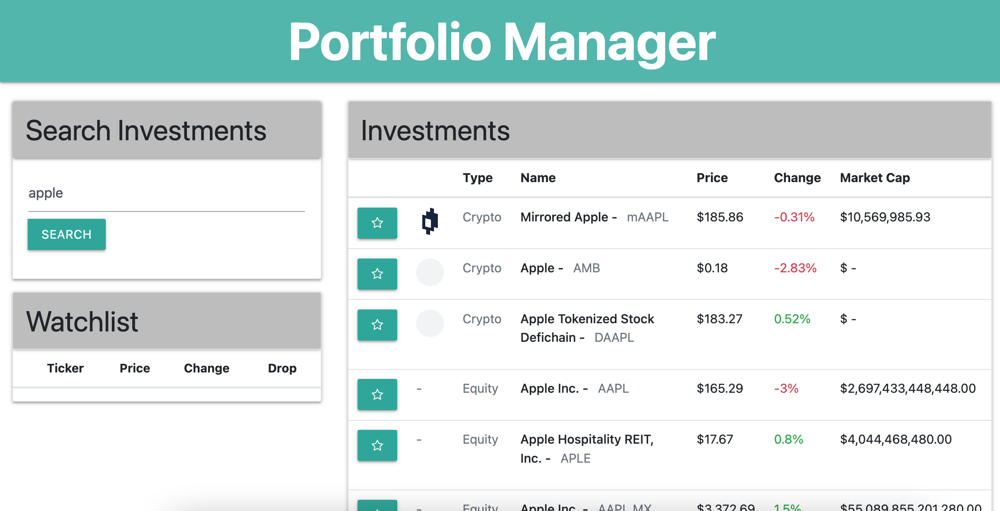
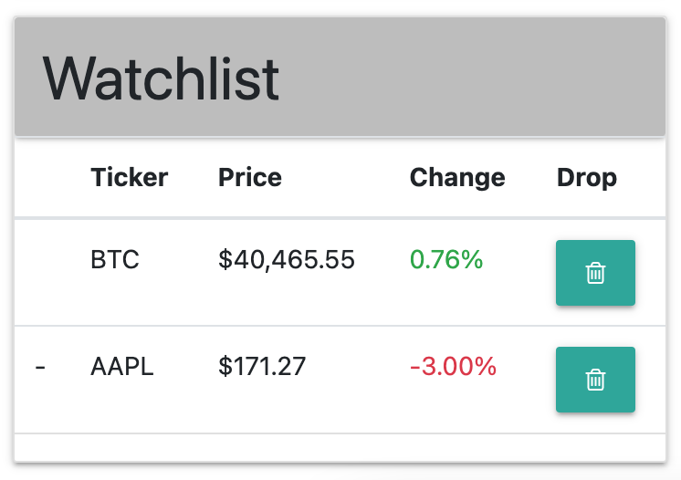

# Group1
Interactive Front-End Project

## User Story:
As a user, I want to search, view, and favorite various investment stocks and crypto currencies 

## Motivation:
Stocks and portfolio websites, specifically crypto are becoming more popular. We wanted to create an easy and clean dashboard to watch stock and crypto activity inspired by Coinbase!

## Technologies used:

HTML, CSS Bootstrap, Materialize, JavaScript, Yahoo Finance API, Coinbase API

## Overview of Application:
The user is presented with a search bar where they can enter the full name of a company/cryptocurrency or simply just the ticker.

The user is then presented with a comprehensive list of every investment that matches their search term. The info presented includes the logo, investment name, ticker, current price, daily change and market cap.

The user can then save an investment to their watchlist via local storage. The watchlist displays the ticker, current price and daily change. This information updates in real time as well. 

The user has the ability to delete any of the investments from the watchlist.

## Screenshots of Deployed Application
Overview of the Dashboard

Watchlist that saves to local storage

## URL of Deployed Application
https://github.com/snehp491/Group1# project-1-clone
